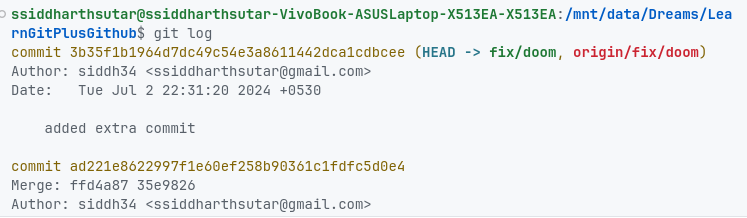

# Task 2: git revert

* Switch to branch fix/doom
* Fix the branch

```txt
# Scenario the test where green sometime before but now they are red can you revert to the second last commit
```

Steps

* See commit id using `git log`



* Revert to commit that is saying corrected code using `git reset --hard commit id` or `git revert commit-id`
  * Commit id is in front of commit as you can see in first image
* Enter `git pull --rebase=false`
* Take pull
* Then force commit to the branch `git push -f`
* If conflict is there then use `git status` & `git add file.ext`
* Then commit
* Check the main branch readme should be updated


