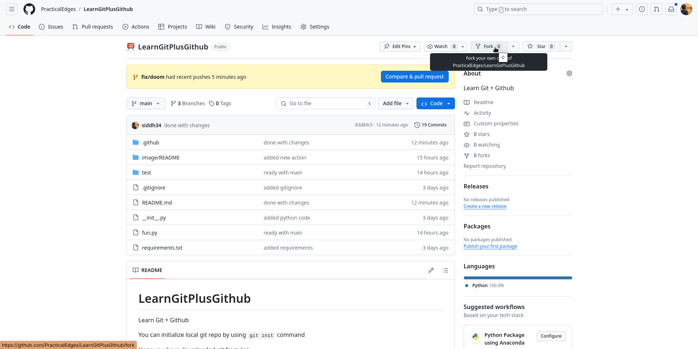
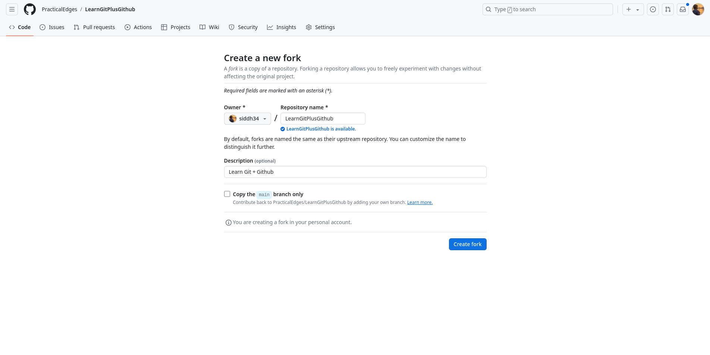
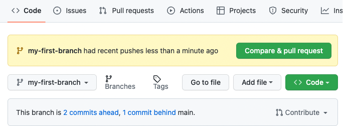
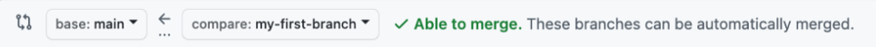
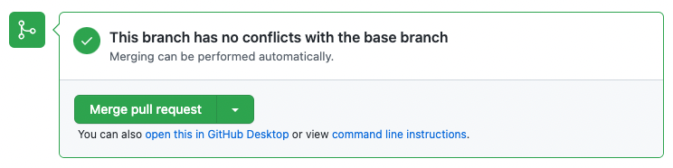
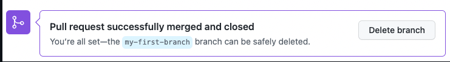

# LearnGitPlusGithub

Learn Git + Github

You can initialize local git repo by using `git init` command

Hope you have downloaded git from [link](https://git-scm.com/downloads)

Clone this repo `git clone` command

```bash
git clone https://github.com/PracticalEdges/LearnGitPlusGithub.git
```

## Configure git

```bash
git config --global user.name "Your Name"

git config --global user.email "you@example.com"
```

This will configure git on your local

You can either setup gpg or ssh for your git account for github

```bash
# For ssh the below works

git config --global gpg.format ssh

git config --global user.signingkey /PATH/TO/.SSH/KEY.PUB
```

```bash
# For gpg keys

git config --global --unset gpg.format

gpg --list-secret-keys --keyid-format=long

git config --global user.signingkey examplekey

git config --global commit.gpgsign true

```

But we will show you a fun way to login to github without this hasel. That will be at the end

## How to fork?

1. Click on fork button



1. Make sure to untick the copy main branch only



## Branching out in this repo after clone

```bash
git checkout -b my-first-branch

# it is important to take pull from main whenever possible

git pull origin main
```

## Task 1

After branching out

* Correct the code located in fun.py
* Command to test code locally: `python -m unittest discover -s . -p "test_*.py"`
* Push the code using below command

```bash
# stage the file

git add .

# commit the changes locally

git commit -m "corrected code"

# push to branch

git push
```

* Make Sure to enable actions in forked repo & go to github and check the PR section

  
* Click on `compare & pull`
* Or you can click on `New pull request`. After that

  1. In the **base:** dropdown, make sure **main** is selected.
  2. Select the **compare:** dropdown, and click `my-first-branch`.
  3. Select the **compare:** dropdown, and click `my-first-branch`.

     
  4. Add title as `my first pr`
  5. Click  **Create pull request** . You will automatically be navigated to your new pull request.
  6. Wait about 20 seconds then refresh this page to see github action magic
  7. Then Merge the PR

  

  

  8. Once PR is merged readme will change
